# Geral
O site é informativo sobre diferentes continentes no mundo, tendo explicações básicas sobre cada um dos lugares com fotos de bandeiras para melhor visualização.

## Protótipo no Figma: https://www.figma.com/design/kNdovH9TzaNR7GEaSBYznT/Untitled?node-id=0-1&t=aGqxqMFFuf9ORMRm-1

## Link de APIs: https://restcountries.com/v3.1/all?fields=name,flags

# Maria L.
## Tela de login
### Mobile 

   A tela contem um fundo vermelho e os botões um vermelho mais escuro. A figura de personagem está centralizada junto aos botões, a figura de engrenagem está no canto inferior esquerdo.
   Todos os botões são funcionais, com excação de apenas um, os botões de "e-mail", "senha" e "remember me", podem escrever e clicsr, já o botão de "login", pode ser clicado, mas não passa parra a página de selecionar, ele não funciona.

### Computador 
   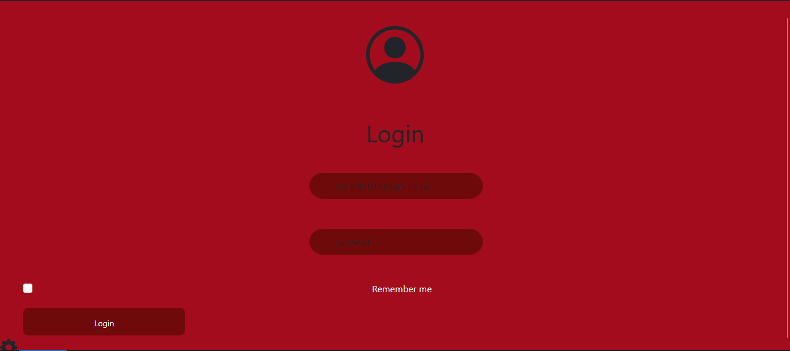

   As mesmas cores presentes na tela de celular, tem na de computador. A figura e os botões estão centralizados, apenas o botão de login e "remeber me" estão no canto inferior esquerdo.
   Os botões contém a mesma função, e o problema do botão de login não foi resolvido. 
   
### Problemas
    A tela de computador deu mais problemas, eu não consegui por os botões de login e "remember me" no centro igual aos outros botões. Um problema das duas telas foi o botão de login, ele não leva para a proxima página, se clicar no botão, não ira acontecer nada.

## Europa 1
### Mobile
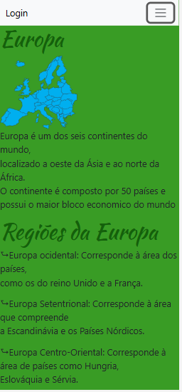
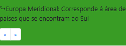
Tive que colocar está pequena imagem, pois não coube tudo em apenas uma imagem só.

   A tela tem uma cor verde clara, enquanto o título tem uma cor verde escuro, as escritas são em pretos, e tem uma fonte diferente do título.
   A navbar está encima, possui a cor branca, contém "botões" que ao clicar encaminhara a primeira página sobre cada continente, também sendo possível ir para a página de login. 
   Na parte de baixo, possui duas setas, a que mostra para a esquerda, volta para a página selecionar, para a direita, irá para a segunda página sobre a Europa. 

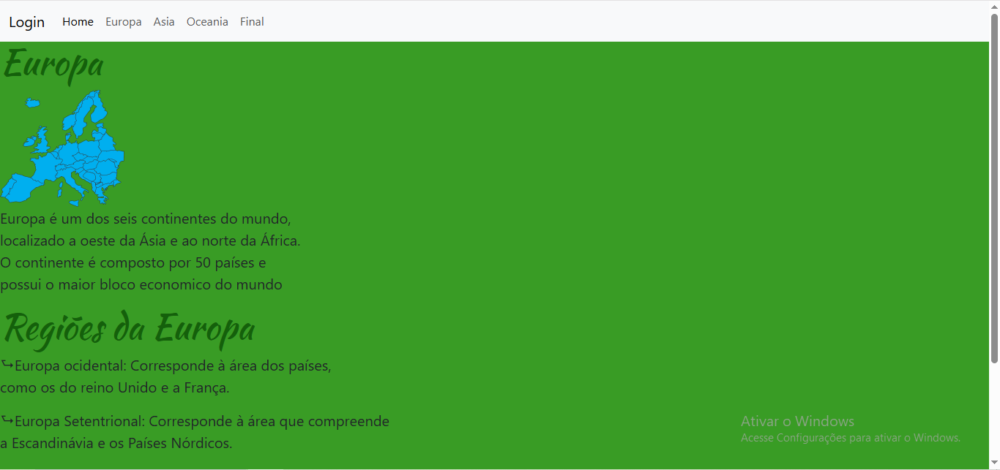
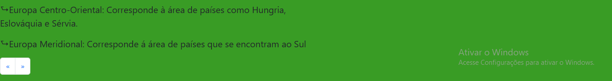

   As cores presentes na tela de celular, são iguais para a de computador. Partes escritas e a imagem estão coladas ao canto esquerdo.
   A navbar continua com o mesmo funcionamento. 
   As setas também coninuam com o mesmo funcionamento. Levando o usuário para a págian selecionar e a proxima página da Europa.

   ### Probelamas

    Eu não consegui mudar a cor do mapa, ele permaneceu azul. Para a tela computador, as letras ficaram um pouco pequenas, então ficou uma grande pare verde.

## Europa 2
### Mobile
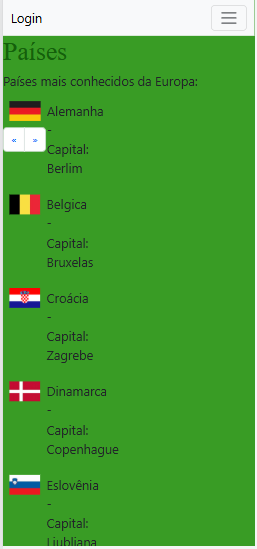

Precisei por três imagens, pois não couberam em apenas uma.

   O fundo tem uma cor verde clara, e seu título um verde escuro. 
   Está págiana tem 12 países e suas capitais, elas estão no canto esquerdo, com suas escritas ao lado e embaixo. 
   A navbar está encima, contendo a mesma função da página anterior, com os "botões" para poder navegar de continente em continente.
   As flechas estão encima, elas levam para a página anterior, a primeira da Europa, e para a página seguinte, levando para o continente da Asia. 

### Computador

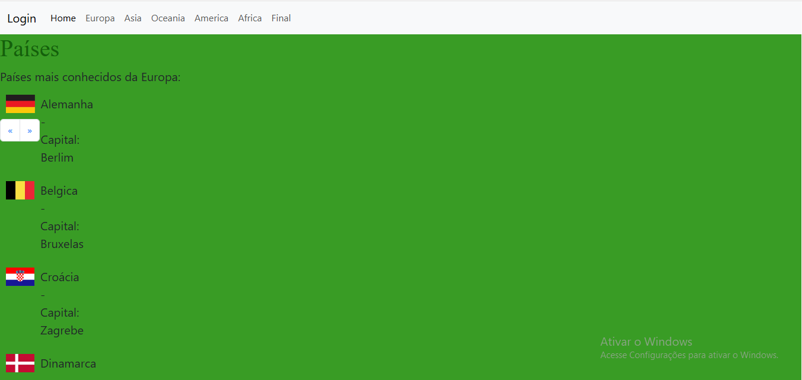
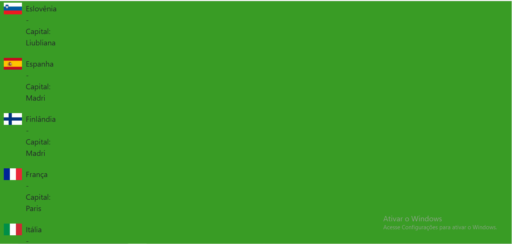
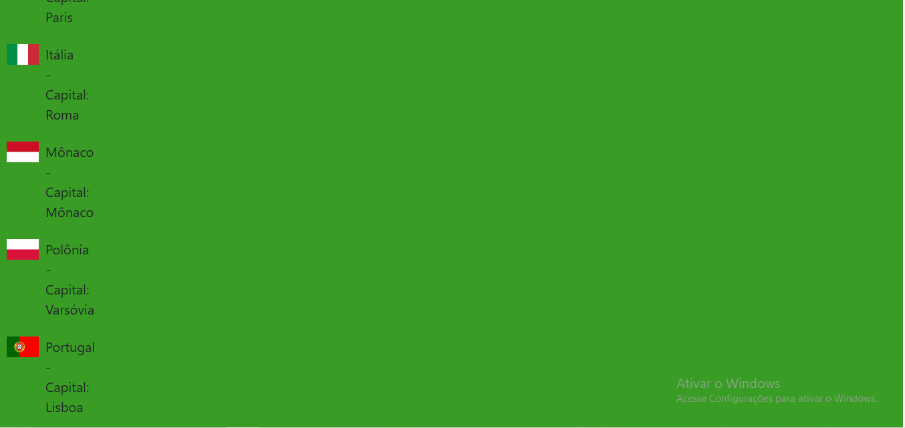

   As cores presentes na tela para celular, estão identicas aqui. 
   A navbar com o mesmo funcionamento e as flechas também.

### Problemas

    Um problemas que estragou completamente minha página, foi um codigo que colocaram na meu CSS, eu não sei se acabou sendo sem querer alguem do meu grupo ou uma pessoa de fora da sala. O codigo fez as capitais dos paíeses irem para baixo da imagem, antes elas estavam ao lado. Eu não consegui indentificar o erro que ainda estava deixando as escritas para baixo. 
   

## Considerações finais

   Boa parte dos códigos eu acabei desistindo de ajeiar, acabando que minhas páginas ficaram esteticamente feias.
   O problema que houve com o código no meu CSS, eu não consegui ajeitar, e faltava pouco tempo para a entrega do trabalho, então eu apenas desesti de ajeitar.
   Se tem API, eu não sei, se eu acabei colocando, eu provavelmente esqueci.
   Talvez a erro de ortografia aqui na readme e no trabalho, sinceramente, me desculpe.

# Bianca A.

## Tela de selecionar
### Mobile

    A tela tem o fundo vermelho com as letras e botões em um tom mais escuro com uma navbar preta no topo, sendo possível apertar nos três riscos para avaliar o site com estrelas.
    Todos os botões são clicáveis e levam até as páginas correspondentes. Já as flechas na parte de baixo direcionam as páginas uma a uma e/ou voltam para a tela de login.

### Computador

    As cores do fundo, fontes e botões são as mesmas do que na opção para celular. As opções de escolha estão centralizadas na página enquanto as flechas de baixo estão no canto inferior esquerdo. A opção de avalie-nos continua a mesma.

### Problemas
    Não consegui criar uma separação entre as opções de botão. O padding estava aumentando as flechas inferiores e desconfigurando a centralização das palavras.
    As flechas inferiores diminuíram tamanho e mudaram a cor junto com as opções de continentes, não ficando centralizadas. Desisti de arrumar.

## Oceania 1
### Mobile

    O fundo é vermelho mais claro que as cores to título e dos subtítulos. O mapa está em azul e os textos de explicação em branco com fontes diferentes.
    A parte de baixo possui duas flechas. A que aponta para a esquerda leva o usuário para a página anterior "Ásia", já a flecha apontando para a direita o leva para a segunda página sobre o continente.
    A navbar do topo pode fazer o usuário caminhar entre as abas. podendo voltar até o login ou ir direto para a página final.

### Computador

    Para usar em web, o fundo, cores e fontes continuam os mesmos. Mas todos os itens na navegação pela navbar aparecem, coisa que só aparecia no celular caso fosse clicado.
    Todos os itens estão dispostos no lado esquerdo da tela, tendo também as flechas no final para passar as páginas.

### Problemas
    Não consegui mudar a cor do mapa para que ele fique vermelho como o resto do site e não consegui deixar tamanhos diferentes em cada aba de maneira aceitavelmente bonita.
    Na tela web, não consegui mudar o texto para preencher melhor a vizualização.

## Oceania 2
### Mobile

    A segunda tela apresenta a mesma paleta de cores da aba anterior, ainda possuindo a navbar e as flechas da parte inferior para melhor navegação.
    Nessa página, diversas imagens são dispostas para a visualização de algumas bandeiras de países e locais famosos nesses lugares. As fotos possum o nome no topo para reconhecimento das imagens.

### Computador

    Para a web, a mesma coisa da página anterior acontece, a única diferença é que são fotos ao invés de textos.

### Problemas
    Não consegui mudar a cor do mapa para que ele fique vermelho como o resto do site.
    Na tela web, não consegui mudar as imagens no centro para preencher melhor a vizualização.

## Tela final
### Mobile

    A tela final possui as mesmas cores do login, com subtítulos em vermelho e outros textos em branco.
    Possui a mesma navbar do "selecionar", possibilitando uma avaliação.
    Tem uma caixa de texto para que um feedback seja enviado ee embaixo tem os nomes de quem desenvolveu.
    A parte inferior possui a mesma flecha das outroas páginas, mas essa com apenas a possibilidade de volta, levando o usuário até a página de seleção novamente.

### Computador

    A tela final para computador é igual a para mobile, apenas com a caixa de texto sendo a única coisa centralizada na tela. De resto, tudo permanece igual.

### Problemas
    A única coisa que não consegui fazer foi deixar, na web, a caixa de texto junto com as outras coisas.

## Considerações finais
    Desisti de ajeitar um monte de coisas depois de diversos erros piorando a situação. Achei estéticamente feio, mas não me importo mais.
    Não sei se coloquei API ou não, nem sei o que fiz aquela hora. Desisti de arrumar o botão do "Selecionar" e realmente tentei várias vezes.
    Tem grandes chances de algum código não fazer o menor sentido. Não me pergunte. Também não sei. Apenas deu certo.

# Kamilly L.

## Ásia 1
## Computador
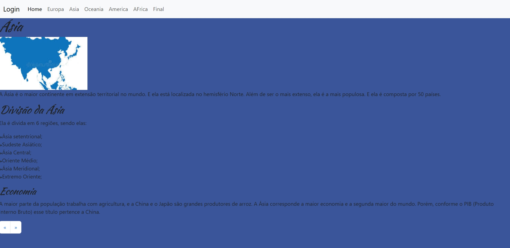
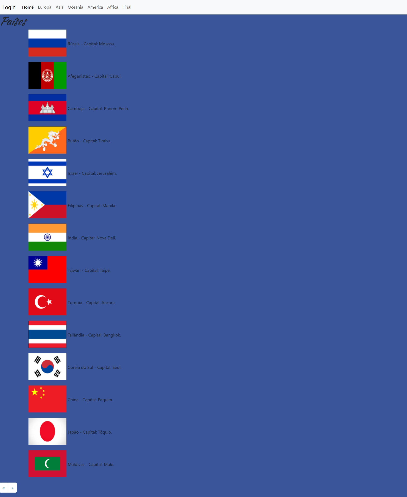
  Nessas páginas, o fundo dele é um azul meio claro e meio escuro, para diferenciar da cor do título e dos subtítulos que são um azul marinho. Todos os textos sobre o continente são pretos.
  Na parte de cima tem a navbar, nela contém "botões" para que possa selecionar em qual continente você queira ver.
  E na parte de baixo, possui "setas", para que você possa ir pro lado direito, que vai para a segunda página sobre a Ásia. E o lado esquerdo, que volta para a página sobre a Europa.

  Na segunda página sobre a Ásia, mostra os páises que estão nesse continente, a navbar permanece igual.
  As setas que etsão na parte de baixo, pode ir para a direita, que vai para a página falando sobre a Oceania, ou vai para a esquerda, que volta para a página falando sobre a Ásia.

 ### Problemas
 O mapa que está na parte de cima, eu não consegui mudar o fundo dele, para que ele fiquasse da mesma cor do fundo da página.

## Ásia 2
## Mobile
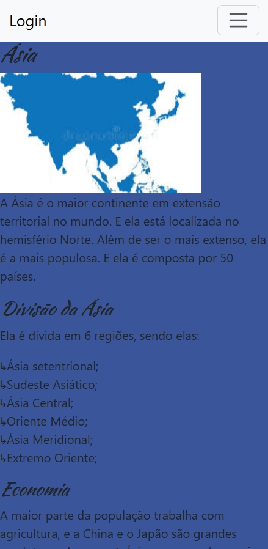

Eu tive que colocar a imagem pequena, pois não coube na mesma imagem.

A página não mudou nada, continua com as mesmas cores e mesmo estilo de letra, igual está no computador. Só ficou meio colado com a lateral da tela do celular.
E a navbar contuna a mesma para selecionar, e as setas está posicionada na parte de baixo no celular, igual com está no computador., para ir tantto para a direita, mostrando mais sobre a Ásia, quantto ir para a esquerda, mostrando sobre a Europa.

## Países no mobile
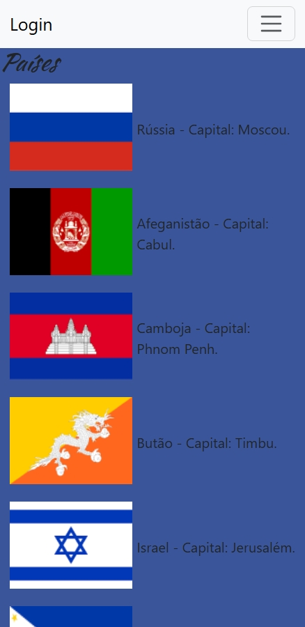
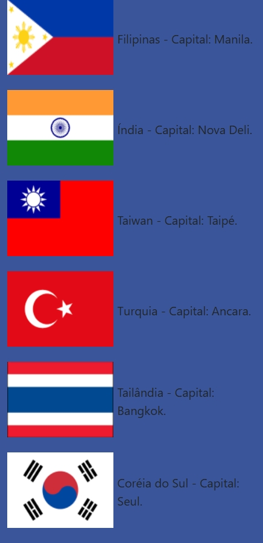
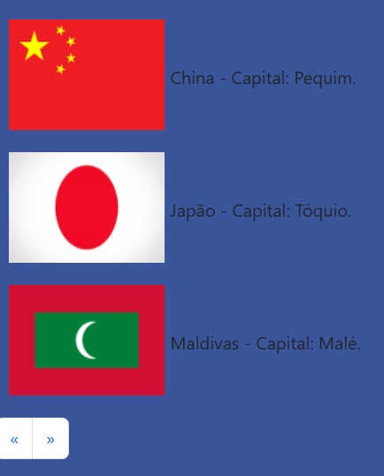

Tive que pôr as imagens em três partes, pois não coube tudo em uma imagem.

Essa página não mudou nada tambèm, continua com a mesma aparência da que está no computador.
E tanto a navbar que está na parte superior do celular, quanto as setas que estão na parte inferior do celular, não tiveram modificação alguma.

### Problemas
Eu tive problema no momento de centralizar as imagens para o celular, pois quando eu voltava para a página dos países, as imagens retornavam a ficar desigual.

## Considerações finais
Tive alguns (muitos) durante o processo desse código, pois não estava funcionando. Mas as minhas colegas (Bianca e Maria Luiza) me ajudaram nesses problemas.
Eu achei a estética até que aceitável, não ficou feio. Porém, não ficou uma maravilha.
Também, tive problemas com o computador, pois alguém excluiu tudo no meu computador. Então tive que abaixar tudo de volta e ajeitar tudo novamente.
Se tem API, eu não faço a mínima idéia, se eu acabei colocando, eu provavelmente esqueci.
Pode conter algum erro no código, então, já peço perdão.

# Isabella V.

## América 1

## América 2

## Considerações finais

# Samara S.

## África 1

tela computador
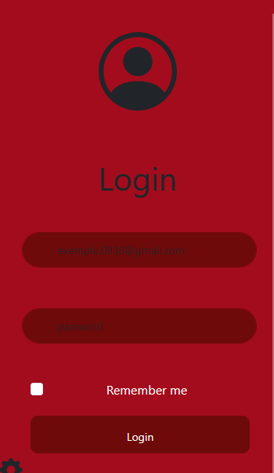
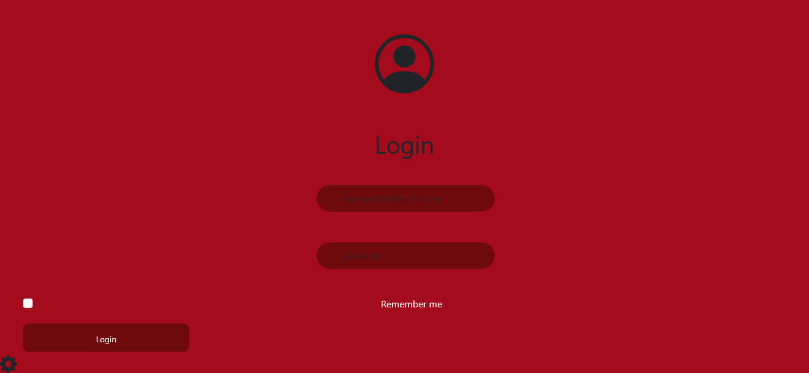
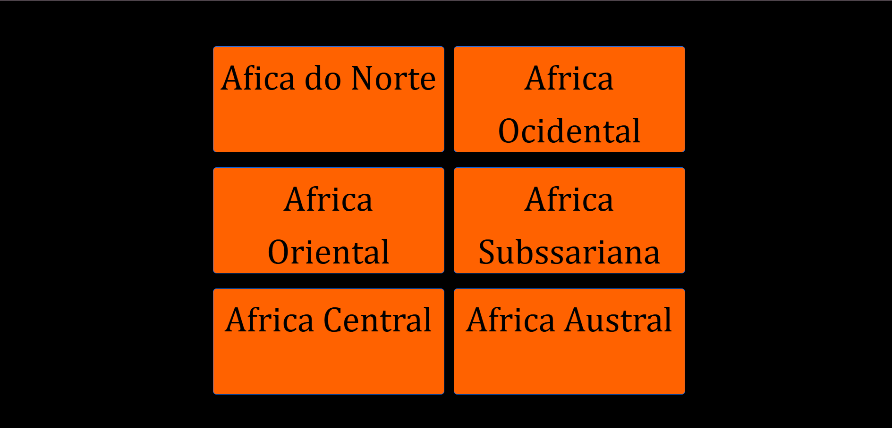

a tela é composta pelo fundo preto com uma imagem do continente africano com um titulo escrito Continente Africano e tem 6 (seis) botões cada um escrito as 6 (seis) partes do continente, a Afica do Norte, Africa Ocidental, Africa Oriental, Africa Subssariana, Africa Central e Africa Austral os botões são da cor laranja com a escrita preta.
Os botões funcionam só que ele não vai pra pagina nenhuma porque eu não terminei kkkk.

# problemas 
Teve varios mais eu acho que o que eu mais tive dificuldade foi com o botão, porque eu não estava conseguindo mudaar a cor tamanho da fonte a e tambem mesmo que tenha tido 3 meses pra fazer eu demorei muito pra fazer uma pagina achei bem chatinho de fazer o trabalho mais foi legalzinho ao mesmo tempo 
tela celular
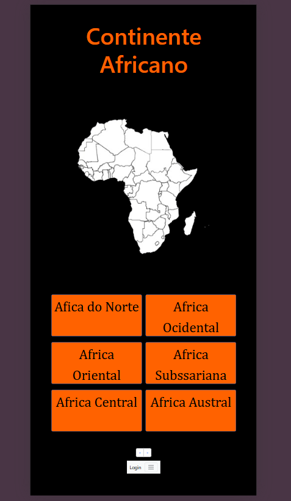
## África 2
,
## Considerações finais
094uu

