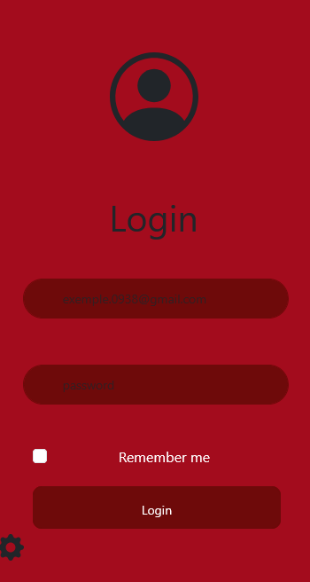

# Geral
O site é informativo e diz sobre diferentes continentes no mundo, tendo explicações básicas sobre cada um dos lugares com fotos de bandeiras para melhor visualização, falando sobre países no continente e informações gerais.

## Link do Protótipo no Figma: https://www.figma.com/design/kNdovH9TzaNR7GEaSBYznT/Untitled?node-id=0-1&t=aGqxqMFFuf9ORMRm-1

## Link de APIs: https://restcountries.com/v3.1/all?fields=name,flags

# Se possível, avaliar o trabalho individualmente

# Maria L.
## Tela de login
### Mobile

    A tela de login possui uma cor vermelha de fundo, uma imagem central e botões com uma cor vermelha mais escura, os botões de email e senha funcionam.

### Computador

    As mesmas cores presentes na tela do celular estão na de computador. Os botões de escrita e figuras estão centralizadas, apenas os botões de login e “remember me” não estão centralizados e não funcionam.

### Problemas
    Não consegui fazer o botão de login funcionar para a página ser passada, quando tentei aplicar o caminho para a página seguinte, ele colocou um outro botão de login que funcionava, um pouco mais à direita.
    Ao tentar deixar o botão de login no centro, ele mudava o tamanho do botão e deixava ele muito para baixo, fazendo ele ficar de uma forma gigante e muito longe das outras figuras de maneira desproporcional.

## Europa 1
### Mobile

Tive que colocar esta pequena continuação pois não coube tudo em apenas uma imagem.

   A tela tem uma cor verde clara, enquanto o título tem um tom mais escuro, as escritas são em preto e tem uma fonte diferente do título.
   A navbar está em cima, possui a cor branca e contém botões que, ao clicar, encaminhará o usuário até primeira página informativa sobre cada continente, também sendo possível voltar até a página de login.
   A parte de baixo possui duas setas, uma que aponta para a esquerda e volta para a página selecionar, e outra para a direita que o levará para a segunda página sobre a Europa.

### Computador

   As cores presentes na tela do celular são iguais às do computador. Possui partes escritas e as imagens estão coladas ao canto esquerdo.
   A navbar continua com o mesmo funcionamento.
   As setas também continuam com o mesmo funcionamento, levando o usuário para a página selecionar e a próxima página da Europa.

   ### Problemas

    Não consegui mudar a cor do mapa, ele permaneceu azul. Para a tela computador, as letras ficaram um pouco pequenas, então ficou uma grande parte verde.

## Europa 2
### Mobile

Precisei colocar três imagens pois o layout não coube em apenas uma.

   O fundo tem uma cor verde clara e título verde escuro.
   Esta página tem 12 países e suas capitais, elas estão no canto esquerdo, com suas escritas ao lado e embaixo.
   A navbar está em cima, contendo a mesma função da página anterior, com os botões para poder navegar de continente em continente.
   As flechas estão em cima, elas levam para a página anterior, a primeira da Europa e para a página seguinte, levando para o continente da Ásia.

### Computador

   As cores presentes na tela para celular, são idênticas aqui.
   A navbar com o mesmo funcionamento e as flechas também.

### Problemas

    Um dos problemas que estragou completamente minha página, foi um código que colocaram na minha CSS, eu não sei se acabou sendo sem querer alguém do meu grupo ou uma pessoa de fora da sala. O código fez as capitais dos países irem para baixo da imagem, antes elas estavam ao lado. Eu não consegui identificar o erro que ainda estava deixando as escritas para baixo, então não foi possível arrumar.

### Commits

## Considerações finais

   Boa parte dos códigos eu acabei desistindo de ajeitar, fazendo com que minhas páginas ficassem esteticamente feias.
   O problema que houve com o código no meu CSS não foi arrumado e faltava pouco tempo para a entrega do trabalho, então eu apenas desisti de ajeitar.
   Se tem API, eu não sei, e se acabei colocando, provavelmente esqueci.
   Agora está refeita a readme, tem commit, link da API, link do figma e tem prints do projeto, espero que esteja um pouco mais correto agora.

# Bianca A.

## Tela de selecionar
### Mobile

    A tela tem o fundo vermelho com as letras e botões em um tom mais escuro com uma navbar preta no topo, sendo possível apertar nos três riscos para avaliar o site com estrelas até 5.
    Todos os botões são clicáveis e levam até as páginas correspondentes. Já as flechas na parte de baixo direcionam as páginas uma a uma e/ou voltam para a tela de login.

### Computador

    As cores do fundo, fontes e botões são as mesmas do que na opção para celular. As opções de escolha estão centralizadas na página enquanto as flechas de baixo estão no canto inferior esquerdo. A opção de avalie-nos continua a mesma.

### Problemas
    Não consegui criar uma separação entre as opções de botão. O padding estava aumentando as flechas inferiores e desconfigurando a centralização das palavras.
    As flechas inferiores diminuíram de tamanho e mudaram a cor junto com as opções de continentes, não ficando centralizadas. Desisti de arrumar.

## Oceania 1
### Mobile

    O fundo é um vermelho mais claro que as cores do título e dos subtítulos. O mapa está em azul e os textos de explicação em branco com fontes diferentes.
    A parte de baixo possui duas flechas. A que aponta para a esquerda leva o usuário para a página anterior "Ásia", já a flecha apontando para a direita o leva para a segunda página sobre o continente.
    A navbar do topo pode fazer o usuário caminhar entre as abas, podendo voltar até o login ou ir direto para a página final.

### Computador

   

    Para usar em web, o fundo, cores e fontes continuam as mesmas. Mas todos os itens na navegação pela navbar aparecem, coisa que só aparecia no celular caso fosse clicado, sempre mantendo uma quantidade confortável de coisas na tela.
    Todos os itens estão dispostos no lado esquerdo, tendo também as flechas no final para passar as páginas.

### Problemas
    Não consegui mudar a cor do mapa para que ele fique vermelho como o resto do site e não consegui deixar tamanhos diferentes em cada aba de maneira aceitavelmente bonita, terminando por deixar um tamanho fixo em ambos.
    Na tela web, não consegui mudar o texto para preencher melhor a visualização, decidindo por deixar como ficou para não “bagunçar” a mesma tela na versão mobile.

## Oceania 2
### Mobile

    A segunda tela apresenta a mesma paleta de cores da aba anterior, ainda possuindo a navbar e as flechas na parte inferior para melhor navegação.
    Nessa página, diversas imagens são dispostas para a visualização de algumas bandeiras de países e locais famosos nesses lugares. As fotos possuem o nome no topo para reconhecimento dos locais.

### Computador

    Para a web, a mesma coisa da página anterior acontece, a única diferença é que são fotos ao invés de textos.

### Problemas
    Não consegui mudar a cor do mapa para que ele fique vermelho como o resto do site.
    Na tela web, não consegui mudar as imagens no centro para preencher melhor a visualização, nem aumentar as mesmas por acabar desconfigurando o feito em mobile.

## Tela final
### Mobile

    A tela final possui as mesmas cores do login, com subtítulos em vermelho e outros textos em branco.
    Possui a mesma navbar do "selecionar", possibilitando uma avaliação.
    Tem uma caixa de texto para que um feedback seja enviado e embaixo os nomes de quem desenvolveu.
    A parte inferior possui a mesma flecha das outras páginas, mas essa com apenas a possibilidade de volta, levando o usuário até a página de seleção novamente.

### Computador

    A tela final para computador é igual a para mobile, apenas com a caixa de texto sendo a única coisa centralizada na tela. De resto, tudo permanece igual.

### Problemas
    A única coisa que não consegui fazer foi deixar, na web, a caixa de texto junto com as outras coisas.

### Commits

## Considerações finais
    Desisti de ajustar um monte de coisas depois de diversos erros piorando a situação. Achei esteticamente feio, mas não me importo mais.
    Não sei se coloquei API ou não, nem sei o que fiz naquela hora. Desisti de arrumar o botão do "Selecionar" e realmente tentei várias vezes.
    Tem grandes chances de algum código não fazer o menor sentido. Não me pergunte. Também não sei. Apenas deu certo (eu acho).

# Kamilly L.

## Ásia 1 - Computador

Nessas páginas, o fundo é em um azul meio claro e meio escuro para diferenciar dos títulos que são um azul marinho, e os textos sobre o continente que são de cor preta.
Na primeira imagem é mostrado um pouco sobre o continente e na parte superior tem uma navbar que permite que a pessoa escolha para qual continente ela quer ir.
Já na parte inferior, temos duas setas que permitem que a pessoa vá tanto para esquerda quanto para a direita (a esquerda vai para os países da Europa, já a direita vai para os países da Ásia).
Na segunda imagem, são mostrados os países que ficam na Ásia. O fundo continua o mesmo da primeira imagem e o título e escrita dos países continuam sem mudanças. A tela continua possuindo a navbar e as setas (esquerda volta para a página da Ásia e a direita vai para a Oceania).

## Problema
Tive um problema com as imagens pois mudava o tamanho e tentava centralizar elas, mas toda vez que eu entrava na página novamente elas voltavam ao tamanho original.

## Ásia 2 - Mobile

Tive que pôr a segunda imagem pois não coube tudo em uma só.

Esta página mostra a primeira parte sobre a Ásia, e nela não teve mudança alguma, permanece igual.
A navbar, setas, títulos e escritas permanecem sendo as mesmas como está no computador.

A parte dos países não coube em uma única imagem, então, separei ela em três.

A página dos países permanecem sendo as mesmas, pois não tinha o que mudar. Como nas outras páginas, tem a navbar e as setas, que vão para as mesmas páginas que eu escrevi na parte do computador.

### Commits

## Considerações finais
Achei a estética até aceitável, não ficou feio, mas também não ficou mil maravilhas. Tive muitos problemas no decorrer deste trabalho. E problemas com o computador, pois alguém desinstalou tudo no meu computador, tive que abaixar e arrumar tudo novamente. Se tiver algum problema com algum código, desde já peço perdão.

# Isabella V.
## América 1
## América 2
## Considerações finais
	Não feito (desistência)

# Samara S.
tela computador

a tela é composta pelo fundo preto com uma imagem do continente africano com um título escrito Continente Africano e tem 6 (seis) botões cada um escrito as 6 (seis) partes do continente, a África do Norte, África Ocidental, África Oriental, África Subsaariana, África Central e África Austral os botões são da cor laranja com a escrita preta.
Os botões funcionam só que ele não vai pra pagina nenhuma porque eu não terminei kkkk.

# problemas
Teve vários mas eu acho que o que eu mais tive dificuldade foi com o botão, porque eu não estava conseguindo mudar a cor tamanho da fonte a e também mesmo que tenha tido 3 meses pra fazer eu demorei muito pra fazer uma pagina achei bem chatinho de fazer o trabalho mais foi legalzinho ao mesmo tempo
tela celular

## África 2
,
## Considerações finais
094uu

